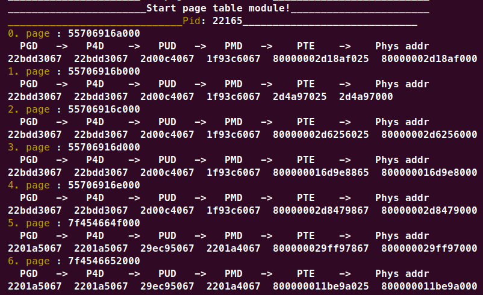

# C Labs 

 


## Содержание

[1. Визуализация таблиц страниц](#1)


<a name="1"></a>
 ##  Визуализация таблиц страниц


> [!NOTE]
> Модуль ядра Linux **page_table_chain.ko** проходит по всем выделенным страницам виртуальной памяти процесса с заданным pid. 
> Для каждой страницы печатается цепочка адресов таблиц страниц разных уровней: PGD -> P4D -> PUD -> PMD -> PTE -> Phys addr. 


1. Скомпилируем программу, которая печатает свой pid, а затем крутится в вечном цикле.  


```
$ cd Task2
$ gcc infinite_loop.c -o inf_loop
$ ./inf_loop 
My pid: 22165
```

2. Этот pid нужно записать в заголовочный файл *pid.h* (либо записать любой известный pid) и скомпилировать модуль ядра *page_table_chain.ko*:
```
$ sed -i '$s/[^[:space:]]*$/'22165'/g' pid.h
$ make
```

3. Затем нужно добавить модуль к запущенному ядру и увидеть результат в логах ядра:
```
$ sudo insmod page_table_chain.ko
$ sudo dmesg
```

 

4. Чтобы посмотреть на цепочку адресов таблиц страниц другого процесса, нужно удалить модуль и повторить шаги 2. и 3. с нужным pid. Чтобы удалить модуль:
```
$ sudo rmmod page_table_chain.ko
```


