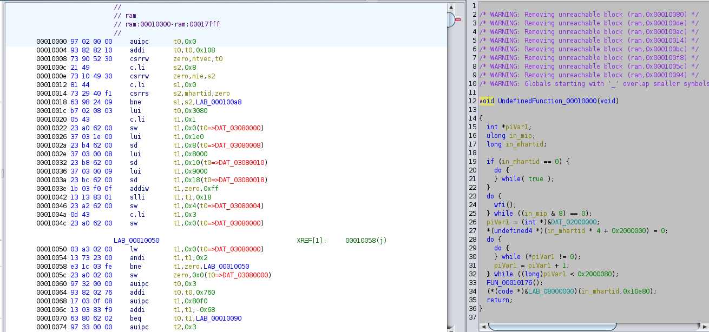
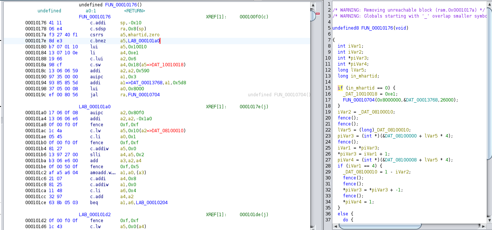

# C Labs 

Этот репозиторий содержит три лабораторных работы по системному программированию. Проанализирован spinlock в ZephyrOS, написан модуль ядра Linux и рассмотрены ключевые этапы Boot ROM чипа SiFive.


## Содержание

[1. Нечестные циклические блокировки в ZephyrOS](#1)


[2. Визуализация таблиц страниц](#2)


[3. Дизассемблирование BootROM](#3)


<a name="1"></a>

## Нечестные циклические блокировки в ZephyrOS

> [!NOTE]
> **Циклическая блокировка (spinlock)** - примитив синхронизации для очень коротких критических секций без изменения состояния потока. Типовой реализацией спин-блокировки является простая циклическая проверка переменной спин-блокировки на доступность. Запрещены прерывания, значит поток не может перейти в состояние ожидания, а просто тратит процессорное время до освобождения другим потоком захватываемой переменной.


* *Чем отличается от mutex?* **Мьютекс** — тоже примитив синхронизации, обеспечивающий взаимное исключение исполнения критических участков кода. Посмотрим главные отличия от спинлока.

  * **Блокирование и неблокирование.** Спинлоки являются неблокирующими, в то время как мьютексы могут быть блокирующими, то есть передают управление планировщику для переключения потоков при невозможности захвата мьютекса.

  * **Использование процессора.** Спинлоки используют больше циклов процессора, но позволяют избежать переключения контекста, в то время как мьютексы экономят ресурсы процессора за счет переключения контекста.

  * **Реализация.** Спинлоки обычно имеют более простую логику, в то время как реализация мьютексов часто опирается на системные вызовы.

  * **Сценарии использования.** Спинлоки лучше подходят для сценариев с очень короткими критическими секциями, в то время как мьютексы более универсальны для приложений общего назначения.

  
Задача состоит в том, чтобы проанализировать уже не актуальнyю и упрощенную реализацию спинлока в ZephyrOS и увидеть в ней недостаток.

**zephyr/include/zephyr/spinlock.h**

```c
struct k_spinlock {
  atomic_t locked;
};

static ALWAYS_INLINE k_spinlock_key_t k_spin_lock(struct k_spinlock *l)
{
  // Value used by a spinlock implementation to store the system 
  // interrupt state at the time of a call to k_spin_lock(). 
  // It is expected to be passed to a matching k_spin_unlock().
  k_spinlock_key_t k;
  
  // Disable all interrupts on the current CPU. 
  k.key = arch_irq_lock(); 

  while (!atomic_cas(&l->locked, 0, 1)) {
    // Perform architecture specific processing within spin loops. 
    arch_spin_relax();
  }
  
  return k;
}

static ALWAYS_INLINE void k_spin_unlock(struct k_spinlock *l,
          k_spinlock_key_t key)
{
  (void)atomic_clear(&l->locked);

  // Unlock interrupts on the current CPU. 
  arch_irq_unlock(key.key); 
}
```


* *Какие в этом лобовом подходе есть проблемы?* 

   
    В данной реализации при ОЧЕНЬ частом использовании возможны блокировки процессоров. Например, возможна ситуация с тремя ядрами. Первое ядро удерживает спинлок и выполняет критическую секцию, а второе и третье ожидают в цикле освобождение спинлока. Первое ядро отпускает спинлок и тот достаётся (случайно) второму ядру, третье продолжает крутиться и ждать. После чего, первое ядро снова хочет войти в критическую секцию и запрашивает спинлок, переходя в цикл ожидания. И когда второе ядро покидает критическую секцию и отпускает спинлок, он снова достаётся (случайно) первому ядру. Такими образом, третье ядро либо получит спинлок позже остальных, что приведёт к его отставанию и задержке программы, либо вовсе не получит, пока первое и второе ядро не закончат использование.


* *Какое может быть самое экстремальное проявление при запуске на реальном железе (а не в Qemu)?*


    В симуляторе время доступа в память, то есть время обращения к переменной спинлока, для всех ядер одинаковое. Это не всегда так для реального железа. Описанная выше проблема может усугубиться в случае разного времени доступа к переменной спинлока. Если первое и второе ядра обращаются к ней быстрее, то для них выше шанс опередить третье, более медленное, ядро и захватить спинлок. Здесь опять окажется, что третье ядро сможет перейти к критической секции позже останых, поэтому другим потокам придётся его ждать, что приведёт к снижению производительности.


* *Как это исправить?*


    Эта проблема может быть устанена введением очереди для владения спинлоком. Ядро, которое пришло позже остальных, встанет в очередь и не сможет получить спинлок до того, как все опередившие его в очереди не закончат использование. Таким образом, первое ядро удерживает спинлок, а в это время в очереди находятся второе и третье ядро. Первое ядро отпускает спинлок, вместе с этим его получает второе ядро. Первое ядро встаёт в очередь. Второе ядро выходит из критической секции и отдаёт спинлок третьему ядру, и только после этого спинлок снова получает первое ядро. Так, каждое ядро гарантированно получает спинлок, и все они продвигаются синхронно. Вот как можно расширить спинлок для поддержания очереди:


```c

struct k_spinlock {
+  atomic_t owner;
+  atomic_t last;
  
  atomic_t locked;
};


static ALWAYS_INLINE k_spinlock_key_t k_spin_lock(struct k_spinlock *l)
{
  k_spinlock_key_t k;
  
  k.key = arch_irq_lock();
  
+  atomic_val_t our_turn = atomic_inc(&l->last);
  
   // Waiting for our turn.
+  while (atomic_get(&l->owner) != our_turn) {
+    arch_spin_relax();
+  }
  
  while (!atomic_cas(&l->locked, 0, 1)) {
    arch_spin_relax();
  }
  
  return k;
}

static ALWAYS_INLINE void k_spin_unlock(struct k_spinlock *l,
          k_spinlock_key_t key)
{

+  (void)atomic_inc(&l->owner);
  
  (void)atomic_clear(&l->locked);

  arch_irq_unlock(key.key); 
}

```

________________________________________________________________________________________________________________________________________


<a name="2"></a>
##  Визуализация таблиц страниц


> [!NOTE]
> Модуль ядра Linux **page_table_chain.ko** проходит по всем выделенным страницам виртуальной памяти процесса с заданным pid. 
> Для каждой страницы печатается цепочка адресов таблиц страниц разных уровней: PGD -> P4D -> PUD -> PMD -> PTE -> Phys addr. 


1. Скомпилируем программу, которая печатает свой pid, а затем крутится в вечном цикле.  


```bash
$ cd Task2
$ gcc infinite_loop.c -o inf_loop
$ ./inf_loop 
My pid: 22165
```

2. Этот pid нужно записать в заголовочный файл [pid.h](Task2/pid.h) (либо записать любой известный pid) и скомпилировать модуль ядра *page_table_chain.ko*:
```bash
$ sed -i '$s/[^[:space:]]*$/'22165'/g' pid.h
$ make
```

3. Затем нужно добавить модуль к запущенному ядру и увидеть результат в логах ядра:
```bash
$ sudo insmod page_table_chain.ko
$ sudo dmesg
```

```bash
[ 8873.324916] _______________________Start page table module!_______________________
[ 8873.324921] _____________________________Pid: 22165_______________________________
[ 8873.324925] 0. page : 55c80e15f000
[ 8873.324928]   PGD   ->   P4D    ->   PUD   ->   PMD   ->    PTE    ->      Phys addr 
[ 8873.324929] 20f27b067  20f27b067  3056c4067  344910067  800000036ec6b025  800000036ec6b000 
[ 8873.324936] 1. page : 55c80e161000
[ 8873.324936]   PGD   ->   P4D    ->   PUD   ->   PMD   ->    PTE    ->      Phys addr 
[ 8873.324937] 20f27b067  20f27b067  3056c4067  344910067  800000036ec6d025  800000036ec6d000 
[ 8873.324939] 2. page : 55c80e162000
[ 8873.324940]   PGD   ->   P4D    ->   PUD   ->   PMD   ->    PTE    ->      Phys addr 
[ 8873.324940] 20f27b067  20f27b067  3056c4067  344910067  8000000357d0d865  8000000357d0d000 
[ 8873.324942] 3. page : 55c80e163000
[ 8873.324943]   PGD   ->   P4D    ->   PUD   ->   PMD   ->    PTE    ->      Phys addr 
[ 8873.324944] 20f27b067  20f27b067  3056c4067  344910067  800000035e988867  800000035e988000 
[ 8873.324947] 4. page : 7ff30d25e000
[ 8873.324949]   PGD   ->   P4D    ->   PUD   ->   PMD   ->    PTE    ->      Phys addr 
[ 8873.324950] 27eb92067  27eb92067  29d18e067  304592067  800000035e98d867  800000035e98d000 
[ 8873.324953] 5. page : 7ff30d261000
[ 8873.324954]   PGD   ->   P4D    ->   PUD   ->   PMD   ->    PTE    ->      Phys addr 
[ 8873.324955] 27eb92067  27eb92067  29d18e067  304592067  8000000272bf4025  8000000272bf4000 
...
[ 8873.325015] 22. vmalloc page : ffffb61980000000
[ 8873.325017]   PGD   ->   P4D    ->   PUD   ->   PMD   ->    PTE    ->      Phys addr 
[ 8873.325018] 100000067  100000067  1001f8067  1001f9067  800000046f602163  800000046f602000 
```

**Из этого дампа видно, что** 
  * Пустому процессу выделено 23 страницы.
  * Адреса PGD и P4D совпадают, значит это одна и та же страница, то есть в системе, где запускался модуль не пяти, а четырехуровневая таблица страниц. P4D нету.
  * Адреса PGD, PUD и PMD для разных страниц (за исключением vmalloc page и ещё нескольких) одинаковые. Это логично, потому что, действительно, нет смысла для каждого уровня аллоцировать больше одной таблицы страниц, когда всего 23 страницы. В одну 4-х Килобайтную таблицу страниц вмещается 512 8-ми байтовых адресов. 

4. Чтобы посмотреть на цепочку адресов таблиц страниц другого процесса, нужно удалить модуль и повторить шаги 2. и 3. с нужным pid. Чтобы удалить модуль:
```bash
$ sudo rmmod page_table_chain.ko
```

________________________________________________________________________________________________________________________________________


<a name="3"></a>

## Дизассемблирование BootROM

> [!NOTE]
> В бинарный файл была снята часть Boot ROM чипа Hifive Unmatched, начинающаяся с адреса 0х10000 [unmatched_rom_0x10000.bin](Task3/unmatched_rom_0x10000.bin). С помощью *Ghidra* был получен ассемблер [BootROM.S](Task3/BootROM.S). Осталось понять, что он делает.


Согласно спецификации [SiFive FU740-C000 Manual](https://www.sifive.com/document-file/freedom-u740-c000-manual) процесс Boot можно разделить на 5 этапов, первым из которых является выполнение кода из ROM, расположенного по адресу *0x00010000*. Это стадия **ZSBL (Zeroth Stage Boot Loader)**.
    
 

* Сначала происходит инициализация системных регистров *mtvec* и *mie*. После этого выполнение **ZSBL** начинается только ядром 0. А остальные переходят в цикл ожидания. 

```asm
        00010000 97 02 00 00     auipc      t0,0x0
        00010004 93 82 82 10     addi       t0,t0,0x108
        00010008 73 90 52 30     csrrw      zero,mtvec,t0       
        0001000c 21 49           c.li       s2,0x8
        0001000e 73 10 49 30     csrrw      zero,mie,s2
        00010012 81 44           c.li       s1,0x0
        00010014 73 29 40 f1     csrrs      s2,mhartid,zero
        00010018 63 98 24 09     bne        s1,s2,LAB_000100a8  // Non zero hards jump to wait
```
    
* Ядро 0 начинает инициализацию с ECC. Любой блок SRAM или кэш-памяти, содержащий функции ECC, должен быть инициализирован перед использованием. ECC исправляет дефектные биты на основе содержимого памяти, поэтому если память не инициализирована до известного состояния, то ECC не будет работать так, как ожидается. Здесь используется DMA для выполнения операции очистки областей памяти, в которых были обнаружены ECC-ошибки. В конце DMA очищается.

```asm
        00010014 73 29 40 f1     csrrs      s2,mhartid,zero
        00010018 63 98 24 09     bne        s1,s2,LAB_000100a8
        0001001c b7 02 08 03     lui        t0,0x3080                 // channel 0
        00010020 05 43           c.li       t1,0x1
        00010022 23 a0 62 00     sw         t1,0x0(t0=>DAT_03080000) 
        00010026 37 03 1e 00     lui        t1,0x1e0
        0001002a 23 b4 62 00     sd         t1,0x8(t0=>DAT_03080008)  // bytes
        0001002e 37 03 00 08     lui        t1,0x8000
        00010032 23 b8 62 00     sd         t1,0x10(t0=>DAT_03080010) // dest
        00010036 37 03 00 09     lui        t1,0x9000
        0001003a 23 bc 62 00     sd         t1,0x18(t0=>DAT_03080018) // src
        0001003e 1b 03 f0 0f     addiw      t1,zero,0xff
        00010042 13 13 83 01     slli       t1,t1,0x18
        00010046 23 a2 62 00     sw         t1,0x4(t0=>DAT_03080004)  // full speed copy
        0001004a 0d 43           c.li       t1,0x3
        0001004c 23 a0 62 00     sw         t1,0x0(t0=>DAT_03080000)  // start transfer
                             LAB_00010050                             // wait for completion
        00010050 03 a3 02 00     lw         t1,0x0(t0=>DAT_03080000)
        00010054 13 73 23 00     andi       t1,t1,0x2
        00010058 e3 1c 03 fe     bne        t1,zero,LAB_00010050
        0001005c 23 a0 02 00     sw         zero,0x0(t0=>DAT_03080000) // release DMA
        00010060 97 32 00 00     auipc      t0,0x3
```
  
* Затем происходит инициализация области *0x08100000* (rwx) кэша L2. Туда скорее всего записывается следующий этап Boot ROM - **U-Boot SPL**.

```asm
			     LAB_00010080             
        00010080 03 be 02 00     ld         t3,0x0(t0=>DAT_000137c0) // U-Boot SPL code ?
        00010084 23 30 c3 01     sd         t3,0x0(t1=>DAT_08100000) // L2 cache
        00010088 a1 02           c.addi     t0,0x8
        0001008a 21 03           c.addi     t1,0x8
        0001008c e3 6a 73 fe     bltu       t1,t2,LAB_00010080
```

* И после выполнения этих инициализаций ядро 0 записывает бит *MSIP* (*0x02000000* = *msip* for hart 0) в системный регистр *mip* (*MSIP* - третий бит), который означает, что процесс инициалиации ECC и L2 кэша завершён. 

```asm
                             LAB_00010094                               
        00010094 05 49           c.li       s2,0x1
        00010096 23 a0 24 01     sw         s2,0x0(s1=>DAT_02000000) // msip = 1
```

* Другие ядра выполняют wfi (wait for interrupt), пока главным ядром 0 не будет установлен бит *MSIP* в *mip*. После чего ядра выходят из цикла ожидания и сбрасывают этот бит. 

```asm
                             LAB_000100a8              
        000100a8 73 00 50 10     wfi
        000100ac 73 29 40 34     csrrs      s2,mip,zero
        000100b0 13 79 89 00     andi       s2,s2,0x8            // 01000 bit number 3
        000100b4 e3 0a 09 fe     beq        s2,zero,LAB_000100a8 // loop if not set
        000100b8 b7 04 00 02     lui        s1,0x2000
        000100bc 73 29 40 f1     csrrs      s2,mhartid,zero
        000100c0 0a 09           c.slli     s2,0x2
        000100c2 26 99           c.add      s2,s1
        000100c4 23 20 09 00     sw         zero,0x0(s2=>DAT_02000000) // unset msip
```

* Здесь скорее всего аллоцируется 4-x Килобитный стек для каждого ядра.

```asm
        000100de f3 22 40 f1     csrrs      t0,mhartid,zero
        000100e2 b2 02           c.slli     t0,0xc           // 2^12 = 4 KBit
        000100e4 17 01 1d 08     auipc      sp,0x81d0  
        000100e8 13 01 c1 f1     addi       sp,sp,-0xe4
        000100ec 33 01 51 40     sub        sp,sp,t0         // allocate
        000100f0 ef 00 60 08     jal        ra,FUN_00010176  
```

 

* Конфигурация UART. Это универсальный асинхронный приемник/передатчик SiFive. Он обычно используются для последовательного обмена данными между устройствами. Инициализация также выполняется только ядром 0.
                  
```asm
                             FUN_00010176                       
        00010176 41 11           c.addi     sp,-0x10
        00010178 06 e4           c.sdsp     ra,0x8(sp)
        0001017a f3 27 40 f1     csrrs      a5,mhartid,zero
        0001017e 8d e3           c.bnez     a5,LAB_000101a0
        00010180 b7 07 01 10     lui        a5,0x10010      // UART address
        00010184 13 07 10 0e     li         a4,0xe1
        00010188 19 66           c.lui      a2,0x6
        0001018a 98 cf           c.sw       a4,0x18(a5=>DAT_10010018)
```

* **ZSBL** загружает загрузчик следующего этапа **U-Boot SPL** с интерфейса QSPI (Serial Peripheral Interface) с адресами *0x10041000* и *0x10040000*.-Это можно понять по активному использованию этих адресов в коде. 

```asm
                             LAB_000107ce  
        000107ce 23 a0 f9 00     sw         a5,0x0(s3=>DAT_10041000)  // QSPI 1
        000107d2 83 a7 09 06     lw         a5,0x60(s3=>DAT_10041060)
        000107d6 93 05 60 06     li         a1,0x66
        000107da 4e 85           c.mv       a0=>DAT_10041000,s3
        000107dc f9 9b           c.andi     a5,-0x2
        000107de 23 a0 f9 06     sw         a5,0x60(s3=>DAT_10041060)
        000107e2 ef f0 7f a7     jal        ra,FUN_00010258                                  
        000107e6 93 05 90 09     li         a1,0x99
        000107ea 4e 85           c.mv       a0=>DAT_10041000,s3
```

* В конце выполнение передаётся **U-Boot SPL**.


